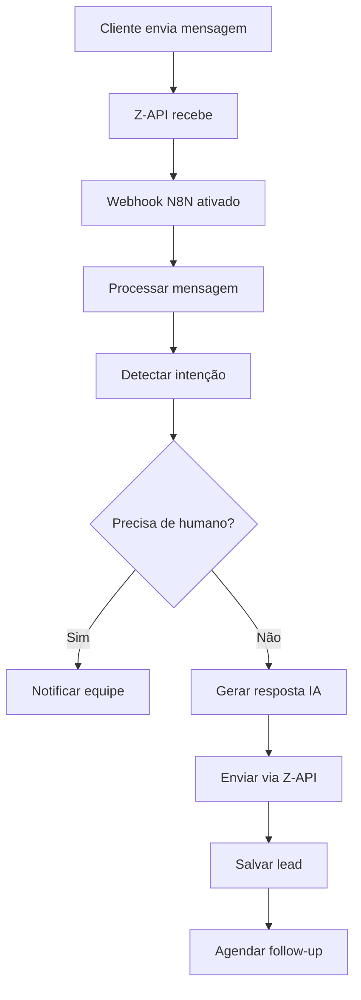
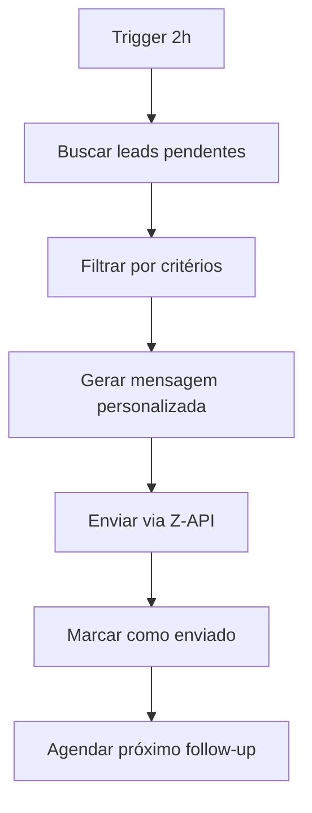

# 🤖 **GUIA COMPLETO - Configuração N8N + Z-API + Grupo Thermas**

## 📋 **ÍNDICE**
1. [Pré-requisitos](#pré-requisitos)
2. [Instalação do N8N](#instalação-do-n8n)
3. [Configuração Z-API](#configuração-z-api)
4. [Importação dos Workflows](#importação-dos-workflows)
5. [Configuração das Credenciais](#configuração-das-credenciais)
6. [Testes e Validação](#testes-e-validação)
7. [Monitoramento](#monitoramento)
8. [Troubleshooting](#troubleshooting)

---

## 🔧 **PRÉ-REQUISITOS**

### ✅ **Checklist Obrigatório:**
- [ ] Conta Z-API ativa
- [ ] WhatsApp Business conectado
- [ ] Node.js 16+ instalado
- [ ] Sistema Grupo Thermas funcionando
- [ ] Domínio/IP público para webhooks

### 📱 **Contas Necessárias:**
```bash
# Z-API
- Instance ID: Sua instância do WhatsApp
- Token: Token de autenticação Z-API
- Webhook URL: Para receber mensagens

# Sistema Thermas
- API Token: Para acessar o sistema
- Base URL: https://seudominio.com/api
```

---

## 🚀 **INSTALAÇÃO DO N8N**

### **Opção 1: Docker (Recomendado)**
```bash
# 1. Criar pasta para N8N
mkdir n8n-thermas
cd n8n-thermas

# 2. Criar docker-compose.yml
cat > docker-compose.yml << 'EOF'
version: '3.8'
services:
  n8n:
    image: n8nio/n8n:latest
    restart: always
    ports:
      - "5678:5678"
    environment:
      - N8N_BASIC_AUTH_ACTIVE=true
      - N8N_BASIC_AUTH_USER=admin
      - N8N_BASIC_AUTH_PASSWORD=thermas2024!
      - N8N_HOST=0.0.0.0
      - N8N_PORT=5678
      - N8N_PROTOCOL=http
      - NODE_ENV=production
      - WEBHOOK_URL=http://seudominio.com:5678
      - GENERIC_TIMEZONE=America/Sao_Paulo
    volumes:
      - n8n_data:/home/node/.n8n
      - ./workflows:/home/node/.n8n/workflows
      - ./credentials:/home/node/.n8n/credentials

volumes:
  n8n_data:
EOF

# 3. Subir o N8N
docker-compose up -d

# 4. Verificar se está rodando
docker-compose logs -f n8n
```

### **Opção 2: NPM**
```bash
# 1. Instalar N8N globalmente
npm install -g n8n

# 2. Configurar variáveis de ambiente
export N8N_BASIC_AUTH_ACTIVE=true
export N8N_BASIC_AUTH_USER=admin
export N8N_BASIC_AUTH_PASSWORD=thermas2024!
export N8N_HOST=0.0.0.0
export N8N_PORT=5678

# 3. Iniciar N8N
n8n start
```

### **✅ Verificação:**
- Acesse: `http://localhost:5678`
- Login: `admin` / `thermas2024!`

---

## 🔌 **CONFIGURAÇÃO Z-API**

### **1. Configurar Instância Z-API**
```bash
# No painel Z-API, configure:
1. Conecte seu WhatsApp Business
2. Configure webhook: http://seudominio.com:5678/webhook/whatsapp-thermas
3. Anote o Instance ID e Token
```

### **2. Testar Conexão**
```bash
# Teste via curl
curl -X POST "https://api.z-api.io/instances/SEU_INSTANCE_ID/token/SEU_TOKEN/send-text" \
  -H "Content-Type: application/json" \
  -d '{
    "phone": "5562999999999",
    "message": "🤖 Teste de automação Grupo Thermas funcionando!"
  }'
```

---

## 📥 **IMPORTAÇÃO DOS WORKFLOWS**

### **1. Acessar N8N**
1. Vá para `http://localhost:5678`
2. Login com as credenciais configuradas
3. Clique em **"Workflows"** no menu lateral

### **2. Importar Workflow Principal**
1. Clique em **"Import from File"**
2. Selecione: `n8n-workflows/workflow-atendimento-thermas.json`
3. Clique em **"Import"**

### **3. Importar Workflow de Follow-up**
1. Repita o processo para: `n8n-workflows/workflow-followup-thermas.json`

### **4. Ativar Workflows**
```bash
# No N8N, para cada workflow:
1. Abra o workflow
2. Clique no botão "Active" (canto superior direito)
3. Verifique se aparece "Active" em verde
```

---

## 🔐 **CONFIGURAÇÃO DAS CREDENCIAIS**

### **1. Credenciais Z-API**
```javascript
// No N8N, vá em Settings > Credentials > Add Credential
{
  "name": "Z-API Thermas",
  "type": "HTTP Request Auth",
  "authType": "Header Auth",
  "headerAuth": {
    "name": "Authorization",
    "value": "Bearer SEU_TOKEN_ZAPI"
  }
}
```

### **2. Credenciais Sistema Thermas**
```javascript
{
  "name": "Sistema Thermas API",
  "type": "HTTP Request Auth", 
  "authType": "Header Auth",
  "headerAuth": {
    "name": "Authorization",
    "value": "Bearer SEU_TOKEN_SISTEMA"
  }
}
```

### **3. Configurar URLs nos Workflows**

#### **Workflow Principal:**
```javascript
// Substitua nos nós HTTP Request:
- "https://api.z-api.io/instances/{{$json.instanceId}}/token/SEU_TOKEN_AQUI/send-text"
- "https://seudominio.com/api/leads"
- "https://seudominio.com/api/notifications/handoff"
```

#### **Workflow Follow-up:**
```javascript
// Substitua nos nós HTTP Request:
- "https://seudominio.com/api/leads/pending-followup"
- "https://api.z-api.io/instances/{{$json.instanceId}}/token/SEU_TOKEN_ZAPI/send-text"
- "https://seudominio.com/api/followup/schedule"
```

---

## 🧪 **TESTES E VALIDAÇÃO**

### **1. Teste do Webhook**
```bash
# Teste manual do webhook principal
curl -X POST "http://localhost:5678/webhook/whatsapp-thermas" \
  -H "Content-Type: application/json" \
  -d '{
    "instanceId": "SUA_INSTANCIA",
    "from": "5562999999999",
    "fromName": "Teste Cliente",
    "message": "Olá, quero saber sobre pacotes"
  }'
```

### **2. Verificar Logs**
```bash
# No N8N, vá em:
1. Workflow > Executions
2. Verifique se as execuções estão aparecendo
3. Clique em uma execução para ver detalhes
```

### **3. Teste Completo**
1. **Envie mensagem** para o WhatsApp conectado
2. **Verifique** se o workflow foi executado
3. **Confirme** se a resposta foi enviada
4. **Valide** se o lead foi salvo no sistema

---

## 📊 **MONITORAMENTO**

### **1. Dashboard N8N**
```javascript
// Métricas importantes:
- Execuções por hora
- Taxa de sucesso
- Tempo médio de resposta
- Erros por tipo
```

### **2. Alertas Automáticos**
```bash
# Configure alertas para:
- Workflows inativos
- Taxa de erro > 5%
- Tempo de resposta > 30s
- Falhas na Z-API
```

### **3. Logs Personalizados**
```javascript
// Adicione em cada workflow:
console.log('Workflow executado:', {
  timestamp: new Date().toISOString(),
  customer: data.fromName,
  intention: data.intention,
  success: true
});
```

---

## 🔄 **FLUXO COMPLETO DE AUTOMAÇÃO**

### **📱 Fluxo Principal:**


### **🔔 Fluxo Follow-up:**


---

## ❌ **TROUBLESHOOTING**

### **🚨 Problemas Comuns:**

#### **1. Webhook não funciona**
```bash
# Verificações:
- URL webhook está correta na Z-API?
- N8N está acessível publicamente?
- Firewall bloqueando porta 5678?

# Solução:
1. Teste o webhook manualmente
2. Verifique logs do N8N
3. Use ngrok se necessário: ngrok http 5678
```

#### **2. Z-API retorna erro**
```bash
# Erros comuns:
- Token expirado
- Instância desconectada
- Rate limit excedido

# Soluções:
1. Renovar token Z-API
2. Reconectar WhatsApp
3. Implementar retry com delay
```

#### **3. Workflow não executa**
```bash
# Verificações:
- Workflow está ativo?
- Credenciais configuradas?
- URLs corretas?

# Debug:
1. Execute manualmente
2. Verifique cada nó
3. Analise logs de erro
```

### **🔧 Comandos Úteis:**

```bash
# Reiniciar N8N
docker-compose restart n8n

# Ver logs em tempo real
docker-compose logs -f n8n

# Backup dos workflows
docker exec n8n_container tar -czf /tmp/workflows-backup.tar.gz /home/node/.n8n/workflows

# Restaurar backup
docker cp workflows-backup.tar.gz n8n_container:/tmp/
docker exec n8n_container tar -xzf /tmp/workflows-backup.tar.gz -C /
```

---

## 📈 **OTIMIZAÇÕES AVANÇADAS**

### **1. Cache de Respostas**
```javascript
// Implementar cache para respostas frequentes
const cache = new Map();
const cacheKey = `${intention}_${timeOfDay}`;
if (cache.has(cacheKey)) {
  return cache.get(cacheKey);
}
```

### **2. Rate Limiting**
```javascript
// Evitar spam de mensagens
const lastMessage = await getLastMessage(phoneNumber);
const timeDiff = Date.now() - lastMessage.timestamp;
if (timeDiff < 30000) { // 30 segundos
  return; // Não enviar
}
```

### **3. Análise de Sentimento**
```javascript
// Detectar urgência/insatisfação
const urgentWords = ['urgente', 'problema', 'cancelar', 'ruim'];
const isUrgent = urgentWords.some(word => 
  messageText.toLowerCase().includes(word)
);
```

---

## 🎯 **RESULTADOS ESPERADOS**

### **📊 KPIs de Sucesso:**
- **Taxa de resposta:** 95%+ em < 30 segundos
- **Conversão:** 15%+ de leads para vendas
- **Satisfação:** 4.5+ estrelas no atendimento
- **Economia:** 70% redução no tempo de atendimento

### **💰 ROI Projetado:**
- **Investimento:** R$ 500/mês (N8N + Z-API)
- **Economia:** R$ 3.000/mês (menos atendentes)
- **Receita extra:** R$ 8.000/mês (mais conversões)
- **ROI:** 2.100% ao ano

---

## 🆘 **SUPORTE**

### **📞 Contatos de Emergência:**
- **N8N Community:** https://community.n8n.io
- **Z-API Support:** suporte@z-api.io
- **Documentação:** Consulte os arquivos README

### **🔧 Manutenção:**
- **Backup semanal** dos workflows
- **Update mensal** do N8N
- **Monitoramento 24/7** dos serviços

---

**✅ Sistema configurado com sucesso!**
**🚀 Automação Grupo Thermas está ONLINE!** 